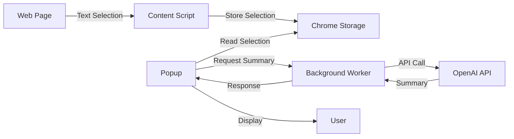
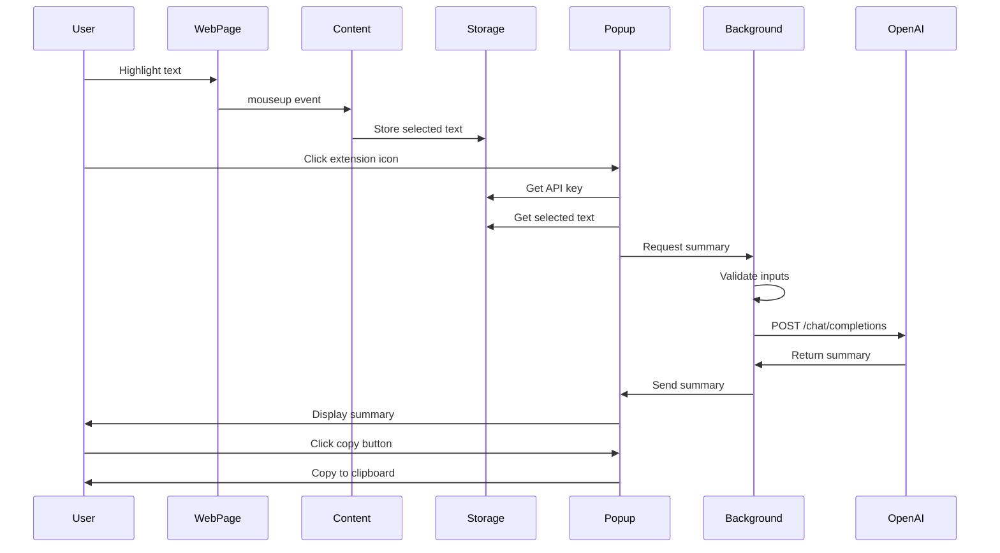

# 🚶 Chrome Summarizer Extension - Walkthrough

This document provides a detailed walkthrough of the Chrome Summarizer Extension, explaining its architecture, components, and how to use and extend it.

## 📋 Table of Contents

1. [Overview](#overview)
2. [Architecture](#architecture)
3. [Component Details](#component-details)
4. [Data Flow](#data-flow)
5. [Running the Extension](#running-the-extension)
6. [Running Tests](#running-tests)
7. [Extending the Extension](#extending-the-extension)

---

## Overview

The Chrome Summarizer Extension is a browser extension that allows users to highlight text on any webpage and generate AI-powered summaries using OpenAI's GPT API. The extension follows Chrome's Manifest V3 specification and uses a modular architecture for maintainability.

### Key Technologies

- **Chrome Extension API** (Manifest V3)
- **OpenAI GPT API** (gpt-3.5-turbo)
- **Vanilla JavaScript** (no frameworks)
- **Chrome Storage API** (for secure key storage)
- **Service Workers** (for background processing)

---

## Architecture

The extension follows a three-component architecture:



### Components

1. **Content Script** (`src/content.js`)
   - Runs on all web pages
   - Captures text selection
   - Stores selected text in Chrome storage

2. **Background Service Worker** (`src/background.js`)
   - Handles API communication
   - Makes requests to OpenAI
   - Processes responses
   - Manages error handling

3. **Popup** (`popup.html`, `popup.js`, `popup.css`)
   - User interface
   - API key management
   - Summary display
   - Copy-to-clipboard functionality

4. **Utilities** (`src/utils.js`)
   - Shared functions
   - Validation logic
   - Constants and configuration
   - Storage helpers

---

## Component Details

### 1. Manifest (`manifest.json`)

The manifest file defines the extension's configuration:

```json
{
  "manifest_version": 3,
  "name": "Text Summarizer",
  "version": "1.0.0",
  "permissions": ["activeTab", "storage", "scripting"],
  "background": {
    "service_worker": "src/background.js"
  },
  "content_scripts": [...],
  "action": {
    "default_popup": "popup.html"
  }
}
```

**Key Points:**
- Uses Manifest V3 (latest standard)
- Requests minimal permissions
- Defines content script injection rules
- Specifies background service worker

### 2. Content Script (`src/content.js`)

Runs on every webpage and captures text selection:

```javascript
document.addEventListener('mouseup', () => {
  setTimeout(captureTextSelection, 100);
});
```

**Responsibilities:**
- Listen for text selection events
- Capture selected text
- Store in Chrome local storage
- Respond to messages from popup

**Why it works:**
- Uses `mouseup` and `keyup` events to detect selection
- Small delay ensures selection is complete
- Stores text for popup to access

### 3. Background Worker (`src/background.js`)

Handles all API communication:

```javascript
chrome.runtime.onMessage.addListener((request, sender, sendResponse) => {
  if (request.action === 'summarizeText') {
    handleSummarization(request.text, request.apiKey)
      .then(summary => sendResponse({ success: true, summary }))
      .catch(error => sendResponse({ success: false, error }));
    return true; // Keep channel open
  }
});
```

**Responsibilities:**
- Receive summarization requests
- Validate inputs
- Call OpenAI API
- Handle errors and retries
- Return results to popup

**API Call Flow:**
1. Validate API key and text
2. Sanitize text
3. Create prompt
4. Make POST request to OpenAI
5. Parse response
6. Return summary

### 4. Popup (`popup.js`)

Manages the user interface:

**State Management:**
- API key input section
- Summary display section
- Loading state
- Error state
- Instruction state

**User Flow:**
1. User opens popup
2. Check if API key exists
3. If no key → show input form
4. If key exists → attempt summarization
5. Display result or error

**Key Functions:**
- `checkApiKey()` - Verifies stored API key
- `handleSaveApiKey()` - Saves new API key
- `attemptSummarization()` - Requests summary
- `handleCopyToClipboard()` - Copies summary

### 5. Utilities (`src/utils.js`)

Shared utility functions:

**Validation:**
- `validateText()` - Checks text length and format
- `validateApiKey()` - Verifies API key format

**Processing:**
- `sanitizeText()` - Removes excess whitespace
- `createSummaryPrompt()` - Formats API prompt
- `parseApiResponse()` - Extracts summary from response

**Storage:**
- `saveToStorage()` - Saves to Chrome storage
- `getFromStorage()` - Retrieves from storage
- `removeFromStorage()` - Deletes from storage

**Error Handling:**
- `formatErrorMessage()` - Creates user-friendly errors

---

## Data Flow

### Complete User Journey



### Storage Schema

**Chrome Sync Storage:**
```javascript
{
  "openai_api_key": "sk-..."  // User's API key
}
```

**Chrome Local Storage:**
```javascript
{
  "selected_text": "...",      // Currently selected text
  "last_summary": "...",        // Last generated summary
  "last_summary_time": 1234567  // Timestamp
}
```

---

## Running the Extension

### Step-by-Step Guide

#### 1. Load Extension

```bash
# Navigate to project directory
cd chrome-extension-summariser

# Open Chrome
# Go to chrome://extensions/
# Enable "Developer mode"
# Click "Load unpacked"
# Select the chrome-extension-summariser folder
```

#### 2. Configure API Key

1. Click the extension icon
2. Enter your OpenAI API key (starts with `sk-`)
3. Click "Save"

#### 3. Use the Extension

1. Navigate to any webpage (e.g., Wikipedia, news site)
2. Highlight text you want to summarize
3. Click the extension icon
4. Wait for the summary to generate
5. Read the summary
6. Click "Copy to Clipboard" if needed

### Example Websites to Try

- **News**: https://www.bbc.com/news
- **Wikipedia**: https://en.wikipedia.org
- **Blogs**: https://medium.com
- **Documentation**: https://developer.mozilla.org

---

## Running Tests

### Automated Tests

The extension includes a comprehensive test suite:

```bash
# Run all tests
node tests/test_extension.js
```

**Test Coverage:**

1. **Text Validation Tests**
   - Empty text rejection
   - Short text rejection
   - Valid text acceptance
   - Long text rejection
   - Null value handling

2. **API Key Validation Tests**
   - Valid format acceptance
   - Invalid prefix rejection
   - Length validation
   - Empty/null handling

3. **Text Sanitization Tests**
   - Whitespace collapsing
   - Trimming
   - Newline normalization

4. **Sample Data Tests**
   - Data structure validation
   - Field presence checks
   - Text length validation

5. **Error Formatting Tests**
   - HTTP status code handling
   - Error message formatting
   - Generic error handling

6. **Prompt Creation Tests**
   - Prompt structure
   - Text inclusion
   - Format validation

### Demo Notebook

Run the Jupyter notebook for interactive testing:

```bash
# Install dependencies
pip install -r requirements.txt

# Set API key (optional)
export OPENAI_API_KEY='sk-your-key-here'

# Run Jupyter
jupyter notebook notebooks/demo.ipynb
```

The notebook demonstrates:
- Loading sample texts
- Calling OpenAI API
- Comparing results with expected summaries
- Analyzing compression ratios
- Testing custom text

---

## Extending the Extension

### Adding New Features

#### 1. Add Language Selection

**Modify `src/background.js`:**

```javascript
function createSummaryPrompt(text, language = 'English') {
  return `Please provide a concise summary in ${language} of the following text in 2-3 sentences:\n\n${text}`;
}
```

**Modify `popup.html`:**

```html
<select id="language">
  <option value="English">English</option>
  <option value="Spanish">Spanish</option>
  <option value="French">French</option>
</select>
```

#### 2. Add Summary Length Options

**Modify `src/background.js`:**

```javascript
const requestBody = {
  model: 'gpt-3.5-turbo',
  messages: [...],
  max_tokens: length === 'short' ? 100 : length === 'medium' ? 150 : 200,
  temperature: 0.7
};
```

#### 3. Add History Feature

**Store summaries:**

```javascript
async function saveSummaryToHistory(text, summary) {
  const history = await getFromStorage('summary_history') || [];
  history.unshift({
    text: truncateText(text, 100),
    summary,
    timestamp: Date.now()
  });
  await saveToStorage('summary_history', history.slice(0, 10));
}
```

#### 4. Add Different AI Models

**Modify `src/background.js`:**

```javascript
const models = {
  'fast': 'gpt-3.5-turbo',
  'quality': 'gpt-4',
  'mini': 'gpt-3.5-turbo-16k'
};

const requestBody = {
  model: models[selectedModel] || 'gpt-3.5-turbo',
  // ...
};
```

### Customizing the UI

#### Change Color Scheme

Edit `popup.css`:

```css
header {
  background: linear-gradient(135deg, #FF6B6B 0%, #4ECDC4 100%);
}

.btn-primary {
  background: linear-gradient(135deg, #FF6B6B 0%, #4ECDC4 100%);
}
```

#### Add Dark Mode

```css
@media (prefers-color-scheme: dark) {
  body {
    background: #1a1a1a;
  }
  
  .container {
    background: #2d2d2d;
    color: #ffffff;
  }
}
```

### Modifying API Behavior

#### Change Summary Style

Modify the system prompt in `src/background.js`:

```javascript
{
  role: 'system',
  content: 'You are a helpful assistant that creates bullet-point summaries of text.'
}
```

#### Add Retry Logic

```javascript
async function callOpenAIWithRetry(prompt, apiKey, maxRetries = 3) {
  for (let i = 0; i < maxRetries; i++) {
    try {
      return await callOpenAI(prompt, apiKey);
    } catch (error) {
      if (i === maxRetries - 1) throw error;
      await new Promise(resolve => setTimeout(resolve, 1000 * (i + 1)));
    }
  }
}
```

---

## Best Practices

### Security

1. **Never hardcode API keys** - Always use Chrome storage
2. **Validate all inputs** - Check text length and API key format
3. **Sanitize text** - Remove excess whitespace and special characters
4. **Use HTTPS** - OpenAI API uses secure connections

### Performance

1. **Minimize API calls** - Only call when necessary
2. **Cache results** - Store last summary to avoid duplicate calls
3. **Debounce events** - Add delays to text selection handlers
4. **Limit text length** - Prevent excessive token usage

### User Experience

1. **Show loading states** - Indicate when processing
2. **Handle errors gracefully** - Display user-friendly messages
3. **Provide feedback** - Confirm actions (e.g., "Copied!")
4. **Keep UI simple** - Avoid overwhelming users

---

## Troubleshooting Guide

### Common Issues

**Issue: Extension not loading**
- Solution: Check `chrome://extensions/` for errors
- Verify all files are present
- Check manifest.json syntax

**Issue: No text captured**
- Solution: Ensure content script is injected
- Check browser console for errors
- Verify text is actually selected

**Issue: API errors**
- Solution: Verify API key is valid
- Check OpenAI account has credits
- Review error messages in console

**Issue: Slow performance**
- Solution: Reduce max_tokens in API call
- Check internet connection
- Consider using gpt-3.5-turbo instead of gpt-4

---

## Additional Resources

- [Chrome Extension Documentation](https://developer.chrome.com/docs/extensions/)
- [OpenAI API Documentation](https://platform.openai.com/docs)
- [Manifest V3 Migration Guide](https://developer.chrome.com/docs/extensions/mv3/intro/)

---

**Happy Summarizing! 📝✨**
